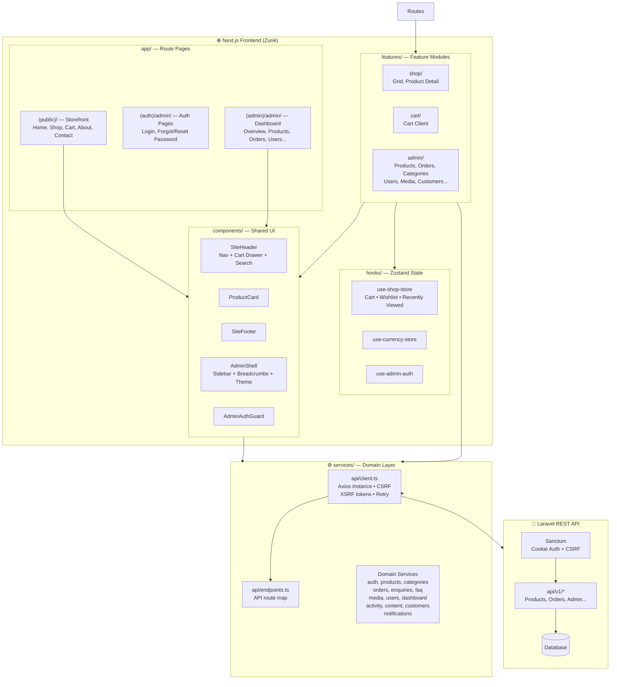
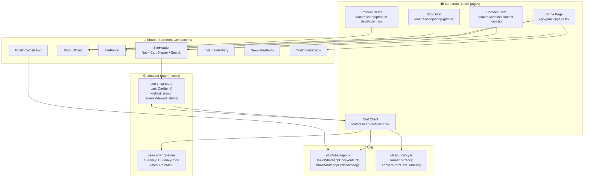
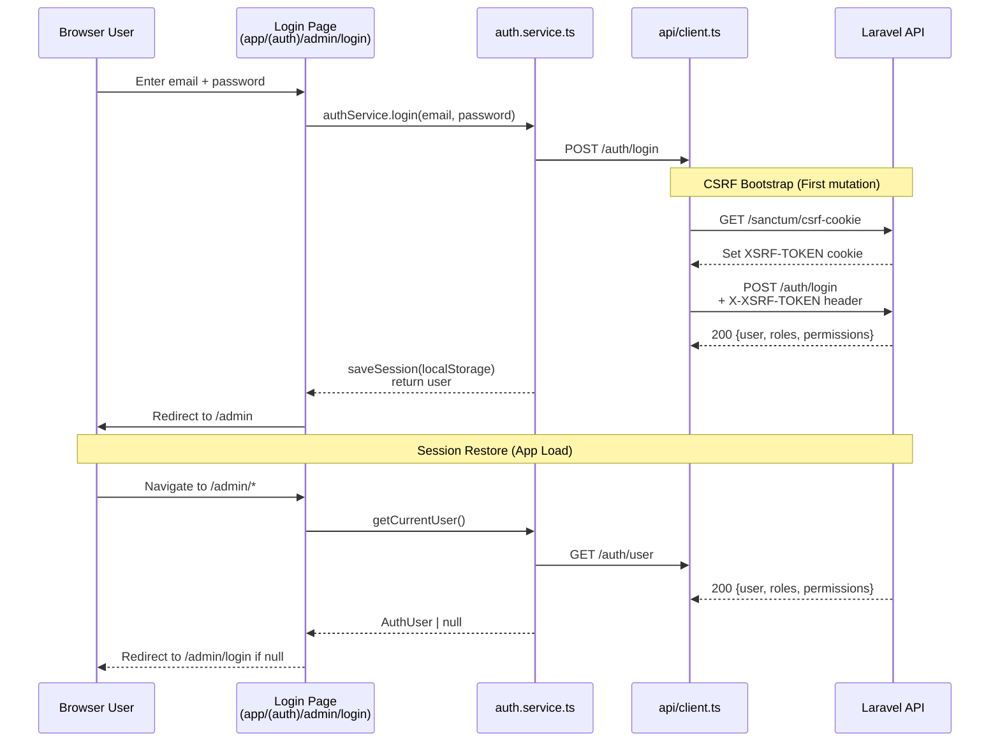
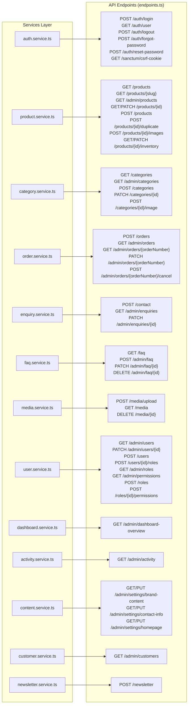
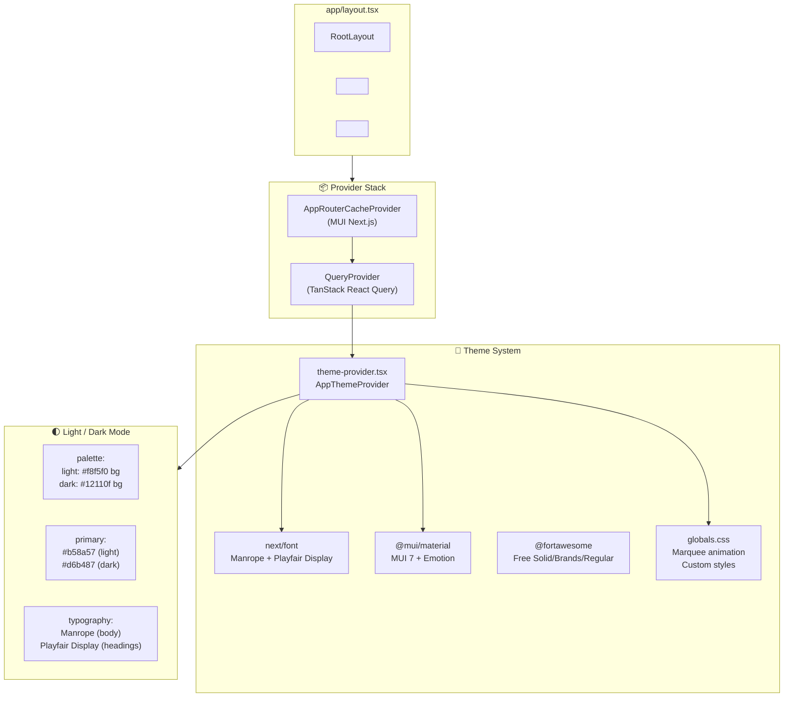
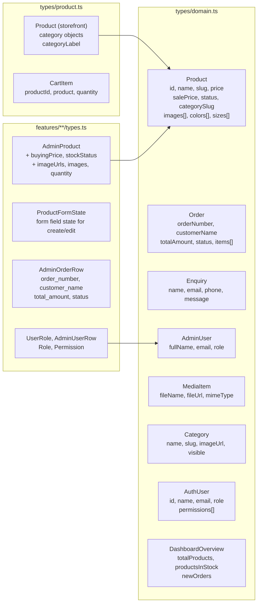

# Zuriè Repository Architecture Chart

Visual breakdown of the Zuriè Next.js codebase — structure, data flow, and module relationships.

---

## 1. High-Level System Architecture



---

## 2. Repository Structure Tree

```mermaid
flowchart LR
    ROOT["zurie/"] --> APP["app/"]
    ROOT --> COMP["components/"]
    ROOT --> FEAT["features/"]
    ROOT --> SERV["services/"]
    ROOT --> HOOKS["hooks/"]
    ROOT --> PROV["providers/"]
    ROOT --> TYPES["types/"]
    ROOT --> UTILS["utils/"]
    ROOT --> CONST["constants/"]
    ROOT --> DOCS["docs/"]
    ROOT --> PUBLIC["public/"]
    ROOT --> LIB["lib/"]

    APP --> APP_PUB["(public)/"]
    APP --> APP_AUTH["(auth)/admin/"]
    APP --> APP_ADMIN["(admin)/admin/"]

    APP_PUB --> P_HOME["page.tsx<br/>Homepage (Hero • Featured<br/>Best Sellers • Categories)"]
    APP_PUB --> P_SHOP["shop/page.tsx<br/>Shop listing"]
    APP_PUB --> P_SLUG["shop/[slug]/page.tsx<br/>Product detail"]
    APP_PUB --> P_CART["cart/page.tsx"]
    APP_PUB --> P_ABOUT["about/page.tsx"]
    APP_PUB --> P_CONTACT["contact/page.tsx"]
    APP_PUB --> P_CATS["categories/[slug]/page.tsx"]

    APP_AUTH --> A_LOGIN["login/page.tsx"]
    APP_AUTH --> A_FORGOT["forgot-password/page.tsx"]
    APP_AUTH --> A_RESET["reset-password/page.tsx"]

    APP_ADMIN --> AD_DASH["page.tsx<br/>Overview Dashboard"]
    APP_ADMIN --> AD_PROD["products/page.tsx"]
    APP_ADMIN --> AD_CATS["categories/page.tsx"]
    APP_ADMIN --> AD_ORD["orders/page.tsx"]
    APP_ADMIN --> AD_CUST["customers/page.tsx"]
    APP_ADMIN --> AD_ENQ["enquiries/page.tsx"]
    APP_ADMIN --> AD_FAQ["faq/page.tsx"]
    APP_ADMIN --> AD_MED["media/page.tsx"]
    APP_ADMIN --> AD_USERS["users/page.tsx"]
    APP_ADMIN --> AD_ACT["activity/page.tsx"]
    APP_ADMIN --> AD_CONTENT["content/page.tsx"]
    APP_ADMIN --> AD_HOME["homepage/page.tsx"]
    APP_ADMIN --> AD_SET["settings/page.tsx"]
    APP_ADMIN --> AD_L["layout.tsx"]

    COMP --> C_HEADER["site-header/<br/>cart-drawer, nav-links<br/>header-actions, search-panel"]
    COMP --> C_ADMIN["admin/<br/>admin-shell, admin-auth-guard<br/>admin-field, admin-image-uploader"]
    COMP --> C_PROD["product-card.tsx"]
    COMP --> C_FOOT["site-footer.tsx"]
    COMP --> C_TESTI["testimonial-cards.tsx"]
    COMP --> C_INSTA["instagram-gallery.tsx"]
    COMP --> C_NEWS["newsletter-form.tsx"]
    COMP --> C_SECTION["section-heading.tsx"]
    COMP --> C_WA["floating-whatsapp.tsx"]

    FEAT --> F_SHOP["shop/<br/>shop-grid, product-detail-client"]
    FEAT --> F_CART["cart/cart-client.tsx"]
    FEAT --> F_CONTACT["contact/contact-form.tsx"]
    FEAT --> F_ADMIN["admin/"]
    F_ADMIN --> FA_PROD["products/<br/>dialogs, table, utils, types"]
    F_ADMIN --> FA_CATS["categories/<br/>table, dialog, actions, utils"]
    F_ADMIN --> FA_ORD["orders/<br/>table, filters, actions"]
    F_ADMIN --> FA_CUST["customers/<br/>table, actions"]
    F_ADMIN --> FA_ENQ["enquiries/<br/>table, filters, actions"]
    F_ADMIN --> FA_MED["media/<br/>grid, toolbar, actions"]
    F_ADMIN --> FA_USERS["users/<br/>actions, types"]
    F_ADMIN --> FA_OVER["admin-overview-client.tsx"]
    F_ADMIN --> FA_FAQ["admin-faq-client.tsx"]
    F_ADMIN --> FA_CONTENT["admin-content-client.tsx"]
    F_ADMIN --> FA_HOME["admin-homepage-client.tsx"]
    F_ADMIN --> FA_SET["admin-settings-client.tsx"]
    F_ADMIN --> FA_ACT["admin-activity-client.tsx"]

    SERV --> S_API["api/<br/>client.ts • endpoints.ts<br/>config.ts • runtime.ts • types.ts"]
    SERV --> S_AUTH["auth/auth.service.ts"]
    SERV --> S_PROD["products/product.service.ts"]
    SERV --> S_CATS["categories/category.service.ts"]
    SERV --> S_ORD["orders/order.service.ts"]
    SERV --> S_ENQ["enquiries/enquiry.service.ts"]
    SERV --> S_FAQ["faq/faq.service.ts"]
    SERV --> S_MED["media/media.service.ts"]
    SERV --> S_USERS["users/user.service.ts"]
    SERV --> S_DASH["dashboard/dashboard.service.ts"]
    SERV --> S_ACT["activity/activity.service.ts"]
    SERV --> S_CONTENT["content/content.service.ts"]
    SERV --> S_CUST["customers/customer.service.ts"]
    SERV --> S_NEWS["notifications/newsletter.service.ts"]
```



---

## 3. Data Request Flow

```mermaid
sequenceDiagram
    participant UI as UI Component<br/>(features/*, app/*)
    participant Hook as Custom Hook<br/>(useQuery / useAdminAuth)
    participant Feature as Feature Action<br/>(features/admin/*-actions)
    participant Service as Domain Service<br/>(services/*.ts)
    participant API as API Client<br/>(services/api/client.ts)
    participant Laravel as Laravel API<br/>(https://api.zurie.co.tz/api/v1)

    alt Storefront Read (Production)
        UI->>Feature: getProducts({category, featured})
        Feature->>Service: productService.listStorefrontProducts(query)
        Service->>API: GET /products?category=&featured=
        API->>Laravel: axios.get (withCredentials)
        Laravel-->>API: 200 {success, data, meta}
        API-->>Service: unwrap data[]
        Service-->>Feature: normalized Product[]
        Feature-->>UI: rendered cards
    end

    alt Admin Create/Update (Mutation)
        UI->>Feature: productActions.create(form)
        Feature->>Service: productService.createProduct(payload)
        Service->>API: POST /products (JSON body)
        API->>API: ensureCsrfCookie()<br/>GET /sanctum/csrf-cookie
        API->>Laravel: POST /products + X-XSRF-TOKEN header
        Laravel-->>API: 201 {success, data:{id}}
        API-->>Service: response
        Service-->>Feature: productId
        Feature->>Service: uploadProductImages(id, files)
        Service->>API: POST /products/{id}/images (FormData)
        Laravel-->>API: 200 {success, data}
        API-->>Feature: success
        Feature-->>UI: update UI state
    end

    alt Checkout Flow
        UI->>Service: orderService.createOrder(payload)
        Service->>API: POST /orders (no prices, IDs+qty only)
        API->>Laravel: POST /orders
        Laravel-->>API: 201 {orderNumber, totalAmount, items}
        API-->>Service: OrderResponse
        Service-->>UI: success → open WhatsApp/Email/SMS
    end

    alt Admin Auth
        UI->>Hook: useAdminAuth()
        Hook->>Service: authService.getCurrentUser()
        Service->>API: GET /auth/user (withCredentials)
        Laravel-->>API: 401/200 {user, roles, permissions}
        API--->>Hook: AuthUser | null
        Hook-->>UI: redirect to /admin/login if no user
    end
```

---

## 4. Storefront Module Flow



---

## 5. Admin Dashboard Module Flow

```mermaid
flowchart TB
    subgraph AdminAuth["🔐 Admin Auth Guard"]
        Login["/admin/login"]
        Guard["AdminAuthGuard<br/>use-admin-auth.ts"]
        Shell["AdminShell<br/>Drawer • Breadcrumbs • Theme"]
    end

    subgraph AdminModules["📊 Admin Modules"]
        Overview["/admin — Overview<br/>admin-overview-client.tsx"]
        Products["/admin/products<br/>admin-products-client.tsx"]
        Categories["/admin/categories<br/>categories-table + form-dialog"]
        Orders["/admin/orders<br/>orders-table + filters"]
        Customers["/admin/customers<br/>customers-table"]
        Users["/admin/users<br/>admin-users-client"]
        Media["/admin/media<br/>media-grid + toolbar"]
        Enquiries["/admin/enquiries<br/>enquiries-table"]
        Faq["/admin/faq<br/>admin-faq-client"]
        Activity["/admin/activity<br/>admin-activity-client"]
        Content["/admin/content<br/>admin-content-client"]
        Homepage["/admin/homepage<br/>admin-homepage-client"]
        Settings["/admin/settings<br/>admin-settings-client"]
    end

    subgraph FeatureActions["🎯 Feature Actions (features/admin/)"]
        ProdActions["product-actions.ts<br/>list • create • update<br/>delete • duplicate • uploadImages"]
        CatActions["category-actions.ts<br/>create • update • delete"]
        OrdActions["order-actions.ts<br/>list • updateStatus • cancel"]
        CustActions["customer-actions.ts"]
        EnqActions["enquiry-actions.ts"]
        MediaActions["media-actions.ts<br/>upload • remove"]
        UserActions["user-actions.ts<br/>createUser • updateRole<br/>syncRolePermissions"]
    end

    subgraph DashboardService["📈 dashboard.service.ts"]
        GetOverview["getOverview()<br/>GET /admin/dashboard-overview"]
    end

    Login --> Guard
    Guard --> Shell
    Shell --> Overview
    Shell --> Products
    Shell --> Categories
    Shell --> Orders
    Shell --> Customers
    Shell --> Users
    Shell --> Media
    Shell --> Enquiries
    Shell --> Faq
    Shell --> Activity
    Shell --> Content
    Shell --> Homepage
    Shell --> Settings

    Products --> ProdActions
    Categories --> CatActions
    Orders --> OrdActions
    Customers --> CustActions
    Enquiries --> EnqActions
    Media --> MediaActions
    Users --> UserActions
    Faq --> FaqActions
    Activity --> ActivityActions
    Overview --> GetOverview
    Overview --> ProdActions
    Overview --> OrdActions
    Overview --> CustActions
```



---

## 6. Authentication Flow



---

## 7. Service ↔ API Endpoint Mapping



---

## 8. Theme & Styling Architecture



---

## 9. Key Type Script Types



---

## Usage

This chart is intended as a living document. Update it as the repository evolves.

- **Section 1** — Overall architecture for onboarding / big picture understanding
- **Section 2** — Directory reference quick-lookup
- **Section 3** — Debugging data flow issues
- **Section 4** — Storefront development
- **Section 5** — Admin module development
- **Section 6** — Auth & session troubleshooting
- **Section 7** — Service/API reference
- **Section 8** — Styling and theming
- **Section 9** — Type relationships

> Built for the **Zuriè** repository — Next.js 15, TypeScript strict, Material UI 7, Zustand, TanStack Query, Font Awesome.
